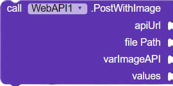

# Extensão para Kodular e Niotron

## - WebAPI

### Sobre
Uma extensão que oferece suporte para operações GET, POST, POST com imagens e DELETE em APIs de forma fácil.

### Tecnologias utilizadas
- Java
- https://ide.niotron.com/

### Funcionalidades
- DELETE  

- GET  

- POST   

### Informações
- [Baixar Extensão](https://github.com/josefabriciofigueiredo/Extensions/raw/main/WebAPI/WebAPI.aix)
- [Ler a documentação](https://josefabriciofigueiredo.github.io/Extensions/WebAPI/doc.html)

## - DateHours

### Sobre
Esta extensão oferece funcionalidades avançadas para manipulação e exibição de data e hora.

### Tecnologias utilizadas
- Java
- https://ide.niotron.com/

### Funcionalidades
- GET DATE OR HOURS   

- COMPARECE DATE OR HOURS          

- FORMAT   

### Informações
- [Baixar Extensão](https://github.com/josefabriciofigueiredo/Extensions/raw/main/WebAPI/WebAPI.aix)
- [Ler a documentação](https://josefabriciofigueiredo.github.io/Extensions/DateHours/doc.html)