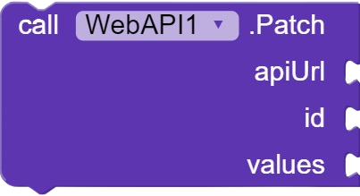
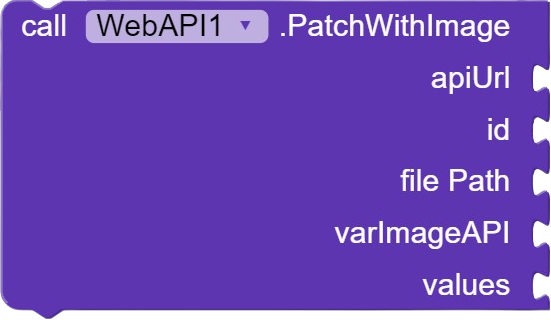

# Extension for Kodular and Niotron

## - WebAPI

### About
An extension that facilitates GET, POST, POST with images, PATCH, PATCH with images, and DELETE operations in APIs.

### Technologies Used
- Java
- https://ide.niotron.com/

### Functions
- DELETE  

- GET  

- POST   

- PATCH   

### Information
- [Download Extension](https://github.com/josefabriciofigueiredo/NoCode-Extensions/raw/main/WebAPI/dados/WebAPI.aix)
- [Read the documentation](https://josefabriciofigueiredo.github.io/NoCode-Extensions/Documentation/doc.html?pag=WebAPI&lang=BR)

## - DateHours

### About
This extension provides advanced functionalities for manipulating and displaying date and time.

### Technologies Used
- Java
- https://ide.niotron.com/

### Functions
- GET DATE OR HOURS   

- COMPARE DATE OR HOURS          

- FORMAT   

### Information
- [Download Extension](https://github.com/josefabriciofigueiredo/NoCode-Extensions/raw/main/DateHours/dados/DateHours.aix)
- [Read the documentation](https://josefabriciofigueiredo.github.io/NoCode-Extensions/Documentation/doc.html?pag=DateHours&lang=BR)